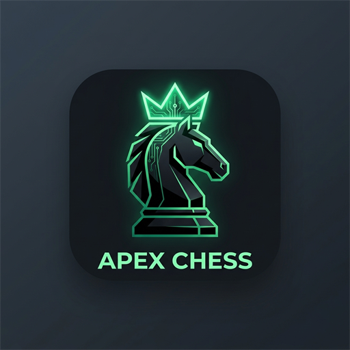

# ♟️ Apex Chess Trainer

<p align="center">
  
</p>

<p align="center">
  <strong>100% Free & Offline Superhuman Chess Trainer powered by Stockfish 19 NNUE & Pedagogical Explainable AI</strong>
</p>

<p align="center">
  
  
  
  
  
  
</p>

---

## 📖 Overview

**Apex Chess Trainer** is a personal training platform engineered to let players confront the absolute strongest chess entity in existence: **Stockfish 19 NNUE (~3650+ Elo)** running at locked maximum difficulty (Skill Level 20, 8-16 threads, AVX-512 hardware acceleration).

Instead of superficial computer scores (`-3.4 blunder`) or raw engine coordinate strings that confuse human players, Apex Chess Trainer incorporates a **pedagogical tactical engine** that breaks down human mistakes in plain English, explaining hanging pieces, removed guards, king safety flaws, and tactical motifs.

---

## ✨ Core Features

* **👑 Superhuman Opponent (Stockfish 19 NNUE)**:
  * Powered by the latest dual-NNUE architecture (`nn-1a298aa575a0.nnue`) running directly on your CPU with AVX-512 vectorization (8–12+ million nodes/sec).
  * Locked at maximum difficulty (**Skill Level 20**)—no dumbed-down blunders or artificial handicaps.
* **🧠 Pedagogical Coach Breakdown**:
  * Human-readable explanations for blunders, mistakes, inaccuracies, and missed tactics.
  * Clearly contrasts *why the played move failed* (e.g., exposed king, unguarding a key square) with *why the engine's alternative works*.
* **📊 Dynamic Perspective Evaluation Bar**:
  * Real-time win probability and centipawn advantage meter mapped to standard White (+) vs. Black (-) conventions.
  * Automatically mirrors top/bottom orientation when flipping the board.
* **💡 Interactive "Try Your Idea" Sandbox**:
  * Step into an interactive sandbox on any review move to test candidate moves directly on the board.
  * Real-time engine evaluation for your alternative ideas and an instant reset button to return to the match line.
* **📈 Game Review & CAPS Accuracy Scoring**:
  * Comprehensive post-game review classifying every move (Brilliant, Great, Best, Inaccuracy, Mistake, Blunder).
  * Lichess/Chess.com style CAPS accuracy percentage calculation for both White and Black.
  * Match history archive with instant replay and review caching.
* **🚀 1-Click Desktop Launcher & PWA**:
  * Native desktop shortcut (`Apex Chess Trainer.lnk`) with custom high-res emerald emblem icon.
  * Starts the local backend and frontend automatically and launches Chrome/Edge in standalone app mode (`--app=http://localhost:5173`).
* **🔒 100% Offline & Free**:
  * Zero paid cloud subscriptions, zero external API keys, zero tracking. All engine computation and review occurs locally on your machine.

---

## 🏗️ Architecture

The application is structured as a decoupled local client-server architecture:

```
├── bin/                       # Native chess engine binaries (Stockfish 19 NNUE via Git LFS)
├── client/                    # React 19 + Vite + TailwindCSS Single-Page Application
│   ├── public/                # PWA icons, manifest.json, sw.js, favicon
│   └── src/
│       ├── components/        # ChessBoard, EvalBar, AnalysisPanel, MoveHistory, EvalGraph
│       ├── hooks/             # Procedural Web Audio API sound generator (useSoundEffects)
│       └── utils/             # Vector SVG piece sets
├── server/                    # Node.js Express REST API & UCI Engine Bridge
│   ├── analyzer.js            # Batch game evaluator & CAPS accuracy calculations
│   ├── engine.js              # Native Stockfish UCI process manager
│   ├── explainer.js           # Symbolic pedagogical tactical explainer
│   ├── history.js             # Local JSON match archive manager
│   └── index.js               # REST API server (Port 5000)
├── data/                      # Local match history storage (data/history.json)
├── docs/                      # Full-depth technical architecture documentation
├── run.bat                    # One-click Windows desktop launcher
└── app.ico                    # Windows application icon
```

---

## ⚡ Quick Start

### Prerequisites
* [Node.js](https://nodejs.org/) (v18 or higher)
* [Git](https://git-scm.com/) (with [Git LFS](https://git-lfs.github.com/))
* Windows 10/11 (for `run.bat` one-click desktop launch)

### Installation

1. **Clone the repository:**
   ```bash
   git clone https://github.com/rd-aswin/apex-chess-trainer.git
   cd apex-chess-trainer
   ```

2. **Pull large engine binary (Git LFS):**
   ```bash
   git lfs pull
   ```

3. **Install dependencies:**
   ```bash
   # Server dependencies
   cd server && npm install
   
   # Client dependencies
   cd ../client && npm install
   cd ..
   ```

4. **Launch the Trainer:**
   * **Windows**: Double-click `run.bat` or run it from terminal.
   * **Manual**:
     ```bash
     # Terminal 1: Backend
     cd server && node index.js
     
     # Terminal 2: Frontend
     cd client && npm run dev
     ```
   * Open your browser at `http://localhost:5173`.

---

## 📚 Technical Documentation

Complete technical specifications are available in the [`docs/`](docs/) directory:
* [01. Project Overview & Philosophy](docs/01_PROJECT_OVERVIEW.md)
* [02. System Architecture & API Specification](docs/02_SYSTEM_ARCHITECTURE.md)
* [03. Hardware Acceleration & Instruction Sets](docs/03_HARDWARE_INTEGRATION.md)
* [04. Stockfish 19 Engine Configuration](docs/04_CHESS_ENGINE_STOCKFISH.md)
* [05. Explainable AI & CAPS2 Mathematical Pipeline](docs/05_EXPLAINABLE_AI_PIPELINE.md)
* [06. UI/UX Design & Audio Specification](docs/06_UI_UX_SPECIFICATION.md)
* [07. Open Source License Audit](docs/07_OPEN_SOURCE_LICENSE_AUDIT.md)

---

## 📜 License

This project is licensed under the **GNU General Public License v3.0 (GPL-3.0)** in alignment with the official Stockfish engine license.