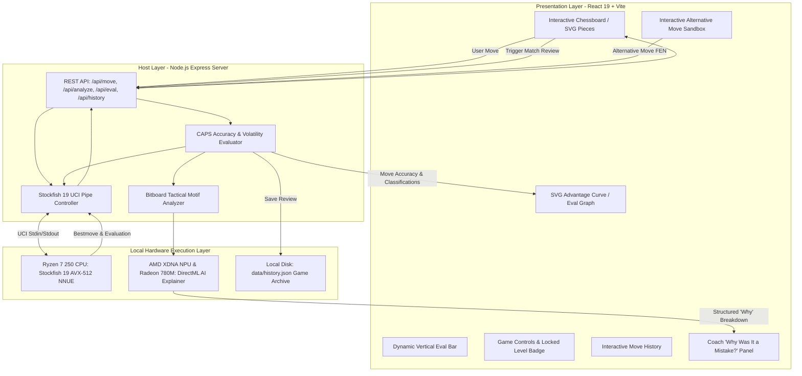

# 02. System Architecture & Technical Specifications

---

## 1. High-Level Architecture Overview

Apex Chess Trainer is designed as a **Local Web Application**, utilizing a decoupled client-server architecture where the frontend provides a high-performance interactive interface and the local backend coordinates native engine calculation and neural inference.



---

## 2. Layer-by-Layer Specifications

### Layer 1: Presentation Layer (Frontend)
* **Framework**: React 19 + Vite 6
* **Styling**: Tailwind CSS (Dark-themed grandmaster cockpit)
* **Board Visualization**: High-resolution SVG vectors (cburnett standard, zero pixelation at 4K)
* **Visual Annotations**: Dynamic SVG line renderer drawing directional arrows (Red for blunders, Green for best moves, Amber for threats)
* **Audio Engine**: Web Audio API synthesizer generating zero-latency piece clicks, capture thuds, and alert chords without external audio files

### Layer 2: Application Host Layer (Local Backend)
* **Runtime**: Node.js v24 (Local process on `127.0.0.1:5000`)
* **Process Management**: `child_process.spawn` managing the native `stockfish.exe` executable over standard `stdin`/`stdout` streams
* **State Safety**: Command queue with timeout protection and non-blocking line buffer parsing

### Layer 3: Calculation Engine Layer (The Beast)
* **Engine**: Stockfish 19 Universal 64-bit binary with embedded dual-NNUE (`nn-1a298aa575a0.nnue`)
* **Execution**: CPU native execution via AVX-512 and AVX2 vector registers (8–12 million nodes/sec)
* **Configuration**: Locked Skill Level 20, 8 CPU threads, 256MB hash table, full search depth (22–35+ plies)

### Layer 4: Symbolic Tactical & Geometric Analyzer
* **Logic Library**: `chess.js` for legal move generation, FEN/PGN state management, and rule validation
* **Geometric Motif Engine**: Bitboard ray-tracer that detects hanging pieces, forks, pins, skewers, compromised king shelters, and vacated guards
* **Threat Detector**: Null-move simulation evaluating the opponent's unhindered tactical plan

### Layer 5: AI Coach & Neural Acceleration Layer
* **Runtime**: Microsoft DirectML / ONNX Runtime GenAI (OGA)
* **Hardware Target**: AMD Ryzen AI XDNA NPU (`PCI\VEN_1022&DEV_1502`) and AMD Radeon 780M GPU
* **Model**: Quantized local language model (Llama-3.2-3B or Qwen-2.5-3B) or deterministic Grandmaster rule engine translating verified facts into human coaching

---

## 3. Communication Protocols & API Specifications

### Backend REST API Endpoints (`http://127.0.0.1:5000`)

| Endpoint | Method | Payload | Response | Description |
| :--- | :--- | :--- | :--- | :--- |
| `/api/status` | `GET` | None | `{ engine, status, level, threads, hash, elo }` | Health check & engine configuration verification. |
| `/api/move` | `POST` | `{ fen, moves, depth, movetime }` | `{ bestMove, score, depth, pv }` | Calculates Stockfish's next move at maximum strength. |
| `/api/analyze` | `POST` | `{ moves, userColor, result }` | `{ accuracy, counts, steps: [...] }` | Executes batch multi-ply game review with "Why" breakdowns. |
| `/api/eval` | `POST` | `{ fen, depth }` | `{ bestMove, primaryScore, variations }` | Real-time position evaluation for the "Try Your Idea" sandbox. |
| `/api/history` | `GET` | None | `{ history: [...] }` | Retrieves previous match summaries from local storage. |
| `/api/history/:id`| `GET` | None | `{ game: {...} }` | Loads full move-by-move analysis of a specific past game. |

### Universal Chess Interface (UCI) Command Pipeline
```text
Client -> Engine: uci
Engine -> Client: id name Stockfish 19
Engine -> Client: id author the Stockfish developers
Engine -> Client: uciok
Client -> Engine: setoption name Threads value 8
Client -> Engine: setoption name Hash value 256
Client -> Engine: setoption name Skill Level value 20
Client -> Engine: isready
Engine -> Client: readyok
Client -> Engine: position startpos moves e2e4 e7e5 g1f3
Client -> Engine: go depth 22 movetime 2000
Engine -> Client: info depth 22 score cp 35 pv b8c6 f1c4 ...
Engine -> Client: bestmove b8c6 ponder f1c4
```
